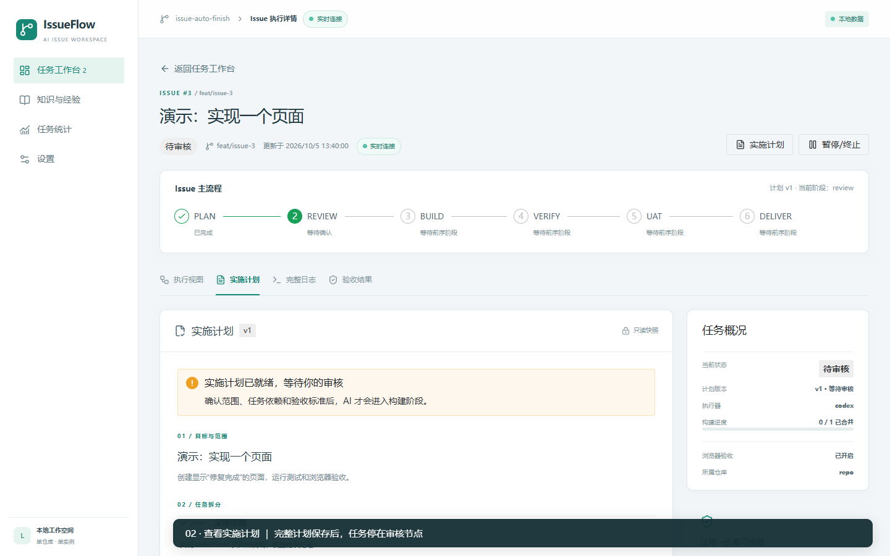

# Issue Auto-Finish

把 GitHub Issue 推进到可验收的 PR：规划、审核、按任务依赖实施、验证、浏览器验收、交付与经验采集。面向单用户、单实例、单仓库，使用 Vue、TypeScript、Express、LangGraph 和本地 JSON。

## 核心流程

[打开交互流程图](docs/media/core-flow.html)：支持缩放、追踪路径和切换主题。关闭浏览器验收时，verify 通过后直接交付；审核驳回会携带上次计划与反馈重新规划。

## 看一次完整操作

[播放／下载录像](docs/media/workbench-demo.webm)：启动演示任务 → 审核计划 → 查看执行和修复日志 → 检查验收报告 → 交付与经验日志。

录像使用模拟 GitHub 与 AI，实际执行本地 Git 和 Playwright；视觉模型复核关闭。模拟 PR 不代表真实仓库交付。

## 本地体验

需要 Node.js ≥22.12、Git 和已安装的 Microsoft Edge。在仓库根目录执行：

~~~powershell
npm ci
npm run build
npm run web:build
$env:E2E_VISUAL_REVIEW_ENABLED = 'false'
npm run demo
~~~

打开 http://127.0.0.1:3000。在另一终端首次启动内置演示 Issue：

~~~powershell
Invoke-RestMethod -Method Post -Uri http://127.0.0.1:3000/api/issues/start -ContentType application/json -Body '{"issueIid":1}'
~~~

在工作台打开任务，进入“实施计划”，确认范围与验收标准后批准。演示数据保存在 .iaf-mini/demo-langgraph-v6，重启会保留进度。只看多状态界面可运行 npm run demo:showcase，访问 http://127.0.0.1:3312。

## 连接自己的仓库

退出演示后，在新终端连接业务仓库：

~~~powershell
npm run init
# 按 env.example 编辑 .iaf-mini/github/.env
npm run doctor
npm start
~~~

配置 GitHub 仓库和 Token、本地克隆目录、基础分支、测试及预览命令。业务仓库可以与工作台源码仓库不同；确保 Git 推送认证和 Codex 登录可用。Codex 通过官方 SDK 执行，CODEX_BINARY 和模型留空可沿用默认配置。

新建带 auto-finish 标签的 Issue 后会自动发现。首次扫描前已有的 Issue 会跳过；当前界面提供计划审核、进度与日志、验收结果、失败或暂停时的人工介入，以及知识、统计和设置。设置保存后重启生效。

## 开发与验证

~~~powershell
npm run dev:all
npm run typecheck
npm test
npm run build
npm run web:build
~~~

浏览器与 Windows 进程清理分别运行 npm run test:e2e 和 npm run test:windows；需要 Chromium 时先运行 npm run e2e:install。真实 Codex 检查单独使用 npm run test:codex，会产生模型调用，模拟回归不能替代它。

## 数据与边界

- 默认运行数据和配置位于 .iaf-mini/github，可用 IAF_MINI_HOME 替换根目录；不读取旧 data/，不自动迁移旧运行格式。
- 每个 Issue 使用独立 worktree 和分支；计划统一审核并保留不可变版本，PR 交付后不自动合并。
- UAT 只依据本轮 Playwright 退出码与有效报告；开启视觉复核时还会检查截图证据。
- 执行日记自动采集；Memory 和 Agent Rule 在“知识与经验”中手动蒸馏。

配置项见 [env.example](env.example)，恢复规则见 [原生工作流](docs/langgraph-native.md)，验收开关见 [E2E 说明](docs/e2e-toggle.md)。历史记录保留在 [docs/](docs/)，不作为当前版本的验证结果。
