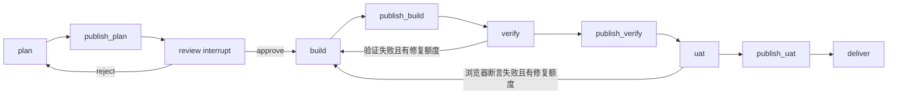

# 后端模块化阅读学习路径

本文面向第一次系统阅读本项目后端代码的开发者。目标不是记住所有文件，而是建立一条可以反复走通的因果链：一个 GitHub Issue 如何被发现、转换为本地任务、经过计划审核、并行实现、验证、浏览器验收，最后安全地创建或更新 PR。

项目后端是 Node.js + TypeScript + Express。运行数据使用本地 JSON，AI 执行使用官方 Codex SDK，工作流使用 LangGraph，平台访问使用 GitHub REST API。当前服务保持单用户、单实例、单仓库模型。

## 一、先建立全局地图

### 1. 先读的文档

按以下顺序阅读，先理解边界，再进入源码：

1. [README.md](../README.md)：了解产品目标、启动方式、配置、数据目录和固定流程。
2. [architecture.md](architecture.md)：确认每个后端模块负责什么，以及模块不应该负责什么。
3. [langgraph-native.md](langgraph-native.md)：理解当前分支为什么用 LangGraph，以及旧编排器哪些内容已经被移到参考测试。
4. [dag-implementation.md](dag-implementation.md)：理解单 Issue 内部任务图、任务凭证和恢复规则。
5. [development.md](development.md)：了解开发阶段、测试分层和常用验证方式。

不要一开始就从 `src/` 目录按字母顺序阅读。这个项目的重要语义分散在状态契约、编排器和副作用模块之间，按目录顺序容易把“展示状态”误认为“执行位置”。

### 2. 用一句话记住三层边界

| 层 | 代表模块 | 主要问题 |
| --- | --- | --- |
| 业务事实 | `tracker`、`dag/IssueRunStore`、`persistence` | 当前 Issue 已经确认发生了什么？ |
| 流程位置 | `orchestration`、`orchestrator/IssueWorkflow` | 下一步应该执行哪个节点？ |
| 副作用执行 | `phases`、`ai-runner`、`git`、`clients`、`e2e` | 如何调用外部系统，并留下可恢复的凭证？ |

最重要的不变量是：

- `IssueWorkflow` 的 LangGraph checkpoint 才是流程位置的权威来源。
- `IssueRecord.lifecycle` 是唯一持久化的业务生命周期；`state`、`currentPhase` 和 `orchestrationState` 是 REST/事件兼容投影，不写入 v4 聚合文件，也不负责推导下一节点。
- 阶段类返回结构化 `PhaseResult`，不直接修改 tracker、调用 GitHub 评论或驱动整体流程。
- 外部成功只有在本地业务凭证和候选提交都确认后，才能进入下一阶段或交付。

## 二、推荐学习顺序

下面分为 12 个模块。每个模块都包含阅读目标、具体文件、需要回答的问题和验证入口。建议一次只学习一个模块，并在完成后用测试验证自己的理解。

### 模块 0：运行时入口与依赖装配

**目标：** 看懂服务启动时创建了哪些对象，以及对象之间如何连接。

**阅读顺序：**

1. [src/run.ts](../src/run.ts)：顶层异常处理、启动失败和进程退出边界。
2. [src/index.ts](../src/index.ts)：单进程装配入口。
3. [src/config.ts](../src/config.ts)、[src/config-schema.ts](../src/config-schema.ts)：配置从环境变量如何变成类型化配置。
4. [src/paths.ts](../src/paths.ts)：数据目录、工作树和运行时文件路径。
5. [src/shutdown/ShutdownSignal.ts](../src/shutdown/ShutdownSignal.ts)：关闭期间为什么拒绝新工作。

**重点追踪：** `index.ts` 中依次创建 `IssueTracker`、`GitHubClient`、AI Runner、主仓库 `GitOperations`、`IssueService`、`IssuePoller`、`WebServer`、知识与蒸馏服务、预览和 worktree 回收器。最后从 shutdown 函数反向理解资源释放顺序。

**完成标准：** 你能解释以下问题：

- 为什么服务只创建一个 `IssueTracker` 和一个 `IssueService`？
- 为什么 `aiRunner.killAll()`、`orchestrator.stopExecutions()`、预览停止和 Web 停止有明确顺序？
- 为什么运行数据不应写入原仓库的 `data/`，而应写入 `.iaf-mini/` 或配置目录？

**验证：** `npm run typecheck`；启动演示使用 `npm run demo`。

### 模块 1：需求来源与平台适配

**目标：** 理解外部 GitHub Issue 如何变成内部统一的 `DemandSpec`。

**阅读顺序：**

1. [src/clients/GitHubClient.ts](../src/clients/GitHubClient.ts)：HTTP 请求、Issue、评论、标签、PR 的平台边界。
2. [src/demand/DemandSpec.ts](../src/demand/DemandSpec.ts)：平台无关的需求契约。
3. `src/demand/adapters/` 下的 GitHub 适配器：外部数据到 `DemandSpec` 的归一化。
4. [src/poller/IssuePoller.ts](../src/poller/IssuePoller.ts)：轮询、标签筛选、领取和调度入口。
5. [src/supplement/SupplementStore.ts](../src/supplement/SupplementStore.ts)：用户补充需求如何进入后续计划。

**需要回答：**

- 外部 Issue 的编号、标题、描述和标签分别在哪里进入内部模型？
- 如何避免轮询器重复领取同一个 Issue？
- GitHub 请求失败时，哪些错误可以重试，哪些状态必须保留给人工处理？
- 为什么“审核反馈同步到 Issue 评论”是附加副作用，而不是流程成功的必要条件？

**验证：** 搜索 `tests/**` 中的 `github-client`、`demand-adapter`、`poller`、`supplement` 测试，优先运行 `npm run test:unit`。

### 模块 2：状态模型与本地聚合事务

**目标：** 这是整个后端最值得精读的模块。要区分“状态展示”“流程检查点”“阶段结果”和“外部调用证据”。

**阅读顺序：**

1. [src/tracker/IssueState.ts](../src/tracker/IssueState.ts)：`IssueRecord`、阶段进度和旧 REST 投影类型。
2. [src/tracker/IssueLifecycle.ts](../src/tracker/IssueLifecycle.ts)：唯一业务生命周期、合法事件转换和旧字段单向投影。
3. [src/dag/contracts.ts](../src/dag/contracts.ts)：`IssueRun`、计划、任务、执行身份和验证凭证。
4. [src/orchestration/WorkflowState.ts](../src/orchestration/WorkflowState.ts)：固定阶段、审核决定、checkpoint 序列化结构。
5. `src/dag/codecs/`、`src/orchestration/codecs/` 与 [src/dag/invariants.ts](../src/dag/invariants.ts)：区分输入字段校验和跨字段业务约束。
6. [src/dag/IssueRunStore.ts](../src/dag/IssueRunStore.ts)：加载、校验、版本、原子写入和事务。
7. [src/tracker/IssueTracker.ts](../src/tracker/IssueTracker.ts)：生命周期操作、事件发布、处理锁和执行身份检查。
8. [src/pipeline/PipelineProjection.ts](../src/pipeline/PipelineProjection.ts)：把生命周期投影成旧 REST/页面枚举。

**必须掌握的概念：**

- 每个 Issue 是一个聚合，`run.json` 是该聚合的权威运行文件。
- `IssueRunStore.transaction()` 每次从磁盘重新读取、修改并原子替换；写入失败后该 Issue 会被阻断，避免继续调度。
- 计划是不可变版本，计划内容通过 digest 校验；审核、任务和验证必须绑定同一计划版本。
- `planRevision`、`buildGeneration`、`workflow.generation`、`dispatchId` 和 `callId` 共同防止旧协程的迟到结果覆盖新执行。
- `phaseProgress` 保存阶段审计和会话恢复信息；它不是流程位置，也不再承担 UAT 配置语义。
- `state`、`currentPhase` 和 `orchestrationState` 是可重建的兼容投影，不写入 v4 文件。
- 每轮是否包含 UAT 由 `run.workflow.definition.phaseIds` 固化，不能被之后的全局设置改写。

**建议练习：** 打开一份演示数据中的 `issues/<number>/run.json`，手工标出：需求、计划版本、审核、workflow checkpoints、任务、候选提交、verify/uat 收据、delivery 身份和调用记录。

**验证：** [tests/unit/dag-state.test.ts](../tests/unit/dag-state.test.ts)；[tests/integration/langgraph-native.test.ts](../tests/integration/langgraph-native.test.ts)。运行 `npm run test:integration -- tests/integration/langgraph-native.test.ts`。

### 模块 3：工作区与 Git 隔离

**目标：** 理解一个 Issue 的主 worktree、build 内部任务 worktree 和主仓库之间的关系。

**阅读顺序：**

1. `src/git/WorktreeContext.ts`：工作树路径和上下文契约。
2. [src/workspace/WorkspaceManager.ts](../src/workspace/WorkspaceManager.ts)：Issue 工作区生命周期和基准分支检查。
3. [src/workspace/WorkspaceConfig.ts](../src/workspace/WorkspaceConfig.ts)：单仓库布局。
4. [src/git/GitOperations.ts](../src/git/GitOperations.ts)：Git 命令封装、worktree、rebase、push 和取消。
5. `src/utils/process.ts`：Windows `.cmd`、空格路径、超时、取消和进程树处理。
6. `src/workspace/WorktreeReaper.ts`：完成后延迟回收，以及失败时为什么保留目录。

**需要回答：**

- 为什么主 Issue worktree 与 build 子任务 worktree 分开？
- 为什么内部任务执行可以并行，但 Git 集成必须通过 mutex 串行？
- `assertOwnedDirectory` 和 `isInside` 防止了什么类型的路径问题？
- 为什么候选提交之后，verify 和 uat 必须检查 HEAD 没有改变？

**验证：** [tests/unit/git-operations.test.ts](../tests/unit/git-operations.test.ts)、[tests/unit/workspace-manager.test.ts](../tests/unit/workspace-manager.test.ts)、[tests/unit/worktree-reaper.test.ts](../tests/unit/worktree-reaper.test.ts)、`npm run test:windows`。

### 模块 4：LangGraph 外层工作流

**目标：** 理解外层固定流程由图表达，而业务事实仍由本地聚合事务保存。

**阅读顺序：**

1. [src/orchestration/Phases.ts](../src/orchestration/Phases.ts)：阶段元信息和固定顺序。
2. [src/orchestration/PhaseResult.ts](../src/orchestration/PhaseResult.ts)：阶段结果、失败和 `requestRetryFrom`。
3. [src/orchestration/PhaseRunner.ts](../src/orchestration/PhaseRunner.ts)：编排层与阶段执行层的接口。
4. [src/orchestrator/IssueCheckpointer.ts](../src/orchestrator/IssueCheckpointer.ts)：LangGraph checkpoint 如何落入 Issue 聚合事务。
5. [src/orchestrator/IssueWorkflow.ts](../src/orchestrator/IssueWorkflow.ts)：图节点、审核 interrupt、retryPolicy、缓存结果和修复回边。
6. `src/orchestrator/steps/RunWorkflowStep.ts`：把图、阶段执行器、预览和交付装配起来。
7. `src/orchestrator/steps/PhaseHelpers.ts`：阶段产物同步的幂等副作用。

**建议画图：**



**必须掌握的恢复规则：**

- 审核请求只 resume 已保存的审核节点，不在 HTTP 请求内执行后续 AI 阶段。
- 普通节点重试由 `retryPolicy` 控制，但已用额度写入 `run.retryUsed`，重启不会返还。
- verify/UAT 的集成修复使用独立的 `repairRounds` 预算。
- 手动从指定阶段重做会创建新的 workflow generation，旧图不能写回当前 Issue。
- 阶段业务结果和副作用操作编号会被缓存，checkpoint 写入窗口发生故障时，重启不会重复调用 AI 或重复评论。

**验证：** [tests/integration/langgraph-native.test.ts](../tests/integration/langgraph-native.test.ts)，重点阅读审核、重启、检查点故障、暂停继续和旧轮次失效的测试。

### 模块 5：阶段抽象与计划审核

**目标：** 看懂阶段类如何把 AI 输出翻译为结构化业务结果，同时保持编排副作用隔离。

**阅读顺序：**

1. [src/phases/BasePhase.ts](../src/phases/BasePhase.ts)：提示词、会话恢复、输出分类和产物校验。
2. [src/phases/PhaseFactory.ts](../src/phases/PhaseFactory.ts)：阶段注册和构造。
3. [src/phases/PlanPhase.ts](../src/phases/PlanPhase.ts)：只读 plan、结构化 JSON、驳回重规划和会话续聊。
4. [src/persistence/PlanPersistence.ts](../src/persistence/PlanPersistence.ts)：计划文档、审核历史和 worktree 不存在时的反馈后备；它不再维护第二份阶段进度文件。
5. `src/prompts/templates.ts`：需求、计划、构建、验证提示词契约。
6. `src/dag/codecs/TaskPlanCodec.ts` 的输入解码、`src/dag/invariants.ts` 的 DAG 规则，以及 `src/dag/contracts.ts` 中的 `renderPlan` 和 digest 逻辑。

**重点思考：** 阶段可以写自己的产物文件，但不能直接推进 Issue 状态；为什么这样设计能让阶段单测不需要完整启动服务？为什么计划必须同时保存结构化 JSON 和给人看的 Markdown？

**验证：** [tests/unit/phases/plan-phase-scenarios.test.ts](../tests/unit/phases/plan-phase-scenarios.test.ts)、[tests/unit/phase-factory.test.ts](../tests/unit/phase-factory.test.ts)。

### 模块 6：AI Runner 与执行生命周期

**目标：** 理解官方 SDK、受管理 worker、并发额度、超时和会话恢复，而不是把 AI 调用当成普通函数调用。

**阅读顺序：**

1. [src/ai-runner/AIRunner.ts](../src/ai-runner/AIRunner.ts)：最小执行接口和 `RunResult`。
2. [src/ai-runner/AIRunnerRegistry.ts](../src/ai-runner/AIRunnerRegistry.ts)：执行器注册、能力和工厂。
3. [src/ai-runner/CodexRunner.ts](../src/ai-runner/CodexRunner.ts)：官方 SDK、plan 沙箱、事件流、timeout 和 session。
4. [src/ai-runner/ManagedCodexRunner.ts](../src/ai-runner/ManagedCodexRunner.ts)：worker 进程、全局并发、超时兜底和等待退出。
5. [src/ai-runner/sdk-worker.ts](../src/ai-runner/sdk-worker.ts)：子进程中如何调用 SDK 并回传事件。
6. [src/ai-runner/ConcurrencyLimiter.ts](../src/ai-runner/ConcurrencyLimiter.ts)：可取消 FIFO 额度。
7. [src/dag/ScopedRunner.ts](../src/dag/ScopedRunner.ts)：给每次调用绑定 Issue、计划、任务和调用身份。

**必须区分：**

- 全局 AI 并发额度与单 Issue 的任务并发不是同一层限制。
- wall-clock timeout、idle timeout、可延长的活跃输出和取消有不同语义。
- AI 调用成功不等于业务阶段成功；还必须检查产物、身份、Git 状态和阶段契约。
- SDK 会话 ID 是不透明值，只能由对应执行器恢复。

**验证：** [tests/unit/ai-runner-registry.test.ts](../tests/unit/ai-runner-registry.test.ts)、[tests/unit/dag-state.test.ts](../tests/unit/dag-state.test.ts) 中的并发和执行身份测试；真实 Codex 检查单独运行 `npm run test:codex`，不要把它与模拟 AI 回归混为一谈。

### 模块 7：build 内部 DAG 与 Git 集成

**目标：** 理解“内部任务并行执行，结果串行集成”的核心实现。

**阅读顺序：**

1. [src/dag/contracts.ts](../src/dag/contracts.ts)：任务定义、任务运行状态、成功凭证和身份。
2. [src/dag/TaskGraphExecutor.ts](../src/dag/TaskGraphExecutor.ts)：依赖边、ready 调度、任务 worktree、执行、rebase 和 fast-forward merge。
3. [src/dag/ScopedRunner.ts](../src/dag/ScopedRunner.ts)：任务调用的身份绑定。
4. [src/dag/RecoveryError.ts](../src/dag/RecoveryError.ts)：证据不足时为什么停止自动恢复。
5. [src/orchestrator/DagPhaseRunner.ts](../src/orchestrator/DagPhaseRunner.ts)：把外层 build/verify/uat 和内部 DAG、候选提交连接起来。

**建议用一个三任务计划手算：** `A` 和 `B` 无依赖，`C` 依赖 `A,B`。分别标出：何时创建 worktree、何时获得成功凭证、何时进入 waiting-merge、何时 rebase、何时更新 `integrationHead`，以及服务在每个 checkpoint 后崩溃时如何恢复。

**关键不变量：**

- 已有成功凭证的任务恢复时优先 integrate，不重新调用 AI。
- `mergeMutex` 保护 Git 集成，避免两个任务同时改同一个 integration branch。
- 任务执行身份失效时，旧结果不能写回当前计划或当前 dispatch。
- 候选提交必须是所有任务合并后的稳定 HEAD，验证过程中不能再改变。

**验证：** [tests/unit/dag-state.test.ts](../tests/unit/dag-state.test.ts)、`tests/integration/` 中包含 DAG、恢复和失败场景的测试；再阅读 [dag-implementation.md](dag-implementation.md) 对照设计决策。

### 模块 8：verify、UAT 与报告判定

**目标：** 理解项目如何拒绝“模型说通过”，只接受真实命令或真实浏览器运行产生的有效凭证。

**阅读顺序：**

1. [src/phases/BuildPhase.ts](../src/phases/BuildPhase.ts)：构建阶段至少必须产生代码变化。
2. [src/phases/VerifyPhase.ts](../src/phases/VerifyPhase.ts)：报告格式检查和 `requestRetryFrom('build')`。
3. [src/verify/VerifyReportParser.ts](../src/verify/VerifyReportParser.ts)：Lint、Build、Test、Todolist 和总结判定。
4. [src/persistence/TodolistExtractor.ts](../src/persistence/TodolistExtractor.ts)：统一的 Markdown checkbox 解析。
5. [src/phases/UatPhase.ts](../src/phases/UatPhase.ts)：真实 Playwright 运行、有效 run ID 和报告。
6. [src/e2e/PlaywrightRunner.ts](../src/e2e/PlaywrightRunner.ts)：浏览器进程、退出码、报告和取消。
7. [src/preview/PortAllocator.ts](../src/preview/PortAllocator.ts)、[src/preview/DevServerManager.ts](../src/preview/DevServerManager.ts)：UAT 前后的预览进程。

**需要回答：**

- 为什么 UAT 不能接受 AI 生成的“验收通过”文字？
- verify 失败和 UAT assertion 失败为什么可以回到 build，而环境启动失败通常不能自动修复？
- `candidateCommit`、`verify.commit` 和 `uat.commit` 不一致时，为什么必须禁止交付？
- 服务重启后，预览端口为什么需要重新核对或清理？

**验证：** [tests/unit/verify-report-parser.test.ts](../tests/unit/verify-report-parser.test.ts)、[tests/unit/phases/verify-phase-scenarios.test.ts](../tests/unit/phases/verify-phase-scenarios.test.ts)、`tests/integration/verify-fix-context-e2e.test.ts`、`tests/integration/windows-preview.test.ts`。

### 模块 9：交付与外部幂等性

**目标：** 理解完成态不是“所有阶段结束”，而是交付凭证、远程分支、PR 和 Issue 回写全部满足条件之后才成立。

**阅读顺序：**

1. [src/dag/DeliveryService.ts](../src/dag/DeliveryService.ts)：push、PR 查找/创建、稳定标记和 Issue 回写。
2. `src/orchestrator/steps/DeliverIssueStep.ts`：交付前后再次检查执行身份和停止意图。
3. [src/orchestrator/steps/FailureHandler.ts](../src/orchestrator/steps/FailureHandler.ts)：失败标记、预览停止和 worktree 保留。
4. `src/clients/GitHubClient.ts` 中的 PR 与评论方法。
5. `src/workspace/WorktreeReaper.ts`：完成后的延迟清理。

**重点理解：** 每个外部动作都有 intent、结果或稳定 marker。若 push、PR 创建或 Issue 评论的网络结果未知，系统宁可停止并要求核对，也不盲目重复创建或覆盖。

**验证：** 搜索 `tests/integration/` 中的 `delivery`、`pr`、`failure-recovery`，并阅读 [tests/integration/failure-recovery.test.ts](../tests/integration/failure-recovery.test.ts)。

### 模块 10：Web API、SSE 与工作台投影

**目标：** 理解 Web 层如何调用后端服务，而不是把前端页面当作业务逻辑来源。

**阅读顺序：**

1. [src/web/WebServer.ts](../src/web/WebServer.ts)：Express 应用和路由装配。
2. `src/web/createApp.ts`：静态资源、错误处理和公共中间件。
3. `src/web/routes/api.ts`：Issue 列表、详情、审核、暂停、继续、重试和报告接口。
4. `src/web/routes/setup.ts`：初始化和配置检查。
5. `src/web/routes/drafts.ts`：AI 需求草稿与创建 Issue。
6. `src/web/routes/knowledge.ts`、`distill.ts`、`analytics.ts`、`uat.ts`：其他后端入口。
7. [src/events/EventBus.ts](../src/events/EventBus.ts)、`src/web/AgentLogStore.ts`：状态和 AI 输出如何进入 SSE。
8. `src/analytics/TaskAnalytics.ts`：从持久化记录计算统计，而不是维护易失计数器。

**需要回答：**

- 审核 API 为什么要校验 `planRevision` 和当前 interrupt？
- 为什么 SSE 事件是状态变化的通知，而不是新的状态事实？
- 页面展示的统一任务状态如何从 `IssueRecord` 和生命周期管理器投影出来？
- 配置保存为什么不立即改变正在运行的服务？

**验证：** `tests/contracts/`、`tests/integration/` 中的 API 测试，以及 [tests/e2e/workbench.test.ts](../tests/e2e/workbench.test.ts)。完整浏览器检查使用 `npm run test:e2e`。

### 模块 11：需求草稿、知识、蒸馏和统计

**目标：** 最后学习这些外围能力，理解它们如何增强主流程但不控制主流程。

**阅读顺序：**

1. `src/demand/DraftService.ts`：原始需求到可编辑草稿，创建防重和未知结果处理。
2. `src/knowledge/KnowledgeLoader.ts`、[src/knowledge/KnowledgeStore.ts](../src/knowledge/KnowledgeStore.ts)、`PromptRules.ts`：项目知识、规则启停和 AI 提示词注入。
3. `src/distill/DiaryStore.ts`、`DiaryCollector.ts`：从已完成或失败 Issue 采集经验。
4. `src/distill/MemoryDistiller.ts`、`AgentRuleDistiller.ts`、[src/distill/DistillScheduler.ts](../src/distill/DistillScheduler.ts)：手动蒸馏、版本和失败隔离。
5. `src/distill/VersionStore.ts`：知识变更版本。
6. [src/analytics/TaskAnalytics.ts](../src/analytics/TaskAnalytics.ts)：从任务记录计算统计。

**设计边界：** 知识引用和经验蒸馏互相独立；蒸馏失败不能让已经交付的 Issue 失败；统计应在服务重启后从持久化数据重新计算；知识正文和索引使用原子写入，但不是跨文件的单一事务。

**验证：** 搜索并运行 `tests/unit/distill/`、`tests/unit/knowledge/`、`tests/unit/analytics/`，再用 [tests/e2e/workbench.test.ts](../tests/e2e/workbench.test.ts) 观察六个工作台入口如何连接这些服务。

## 三、一次完整 Issue 的跟读路线

完成模块阅读后，用下面这条路线做第二遍精读。每一步都从调用者跳到被调用者，不要只看类型定义。

1. `run.ts` 调用 `main()`。
2. `index.ts` 创建配置、平台客户端、AI Runner、tracker、IssueService、poller 和 WebServer。
3. `IssuePoller` 发现带目标标签的 GitHub Issue，并通过 `IssueService` 创建或恢复本地记录。
4. `IssueService` 准备主 worktree、`PlanPersistence` 和 `IssueProcessingContext`。
5. `RunWorkflowStep` 创建 `DagPhaseRunner` 与 `IssueWorkflow`，调用 `workflow.drive()`。
6. `IssueWorkflow` 执行 `plan`，由 `DagPhaseRunner` 创建 `PlanPhase`。
7. `BasePhase` 通过 scoped AI Runner 调用 Codex，`PlanPhase` 校验结构化计划，`IssueRunStore.savePlan()` 保存不可变版本。
8. `IssueWorkflow.review()` 保存 interrupt；Web 审核 API 使用 `resumeReview()` 提交批准或驳回。
9. 批准后 `build` 进入 `TaskGraphExecutor`，内部任务在独立 worktree 执行，成功后串行 rebase 和合并。
10. `DagPhaseRunner` 为 build 创建候选提交；`verify` 生成并解析验证报告。
11. verify 或 UAT 失败时，`IssueWorkflow` 根据 `requestRetryFrom` 和修复额度返回 build。
12. UAT 启动当前候选提交的预览服务，执行真实 Playwright，保存 `runId`、报告和 commit 收据。
13. `deliverIssue()` 校验所有任务、候选提交、verify、UAT 和远程分支凭证，然后 push、复用或创建 PR，并回写 Issue。
14. `DeliverIssueStep` 在一次最终事务中写入完成态；后续由 DiaryCollector、Analytics 和 WorktreeReaper 处理附加工作。

跟读时建议在纸上维护三列：

| 调用 | 写入的事实 | 失败后如何恢复 |
| --- | --- | --- |
| AI / Git / GitHub / Playwright | `run.json` 中的结果、身份或 intent | checkpoint、事务、marker 或人工核对 |

## 四、最值得优先掌握的代码问题

按重要性排序，建议每个问题都能在源码中指出答案：

1. LangGraph checkpoint 与 `IssueRunStore.transaction()` 如何共同覆盖“阶段结果已写入但 checkpoint 尚未写入”的崩溃窗口？
2. 为什么 `currentPhase` 不能作为恢复下一节点的依据？
3. 一个旧 AI 调用在新 dispatch 或新 workflow generation 后返回时，哪一层拒绝它？
4. 任务已经生成成功提交但进程在 merge 前退出时，下一次执行为什么不会重复调用 AI？
5. verify 报告文字、真实命令结果、候选提交和 UAT run ID 分别由谁确认？
6. PR 创建请求返回未知时，系统如何避免重复创建 PR？
7. 知识索引损坏、状态文件写入失败、旧格式数据存在时，系统为什么选择停止而不是自动修复？
8. 哪些状态是业务事实，哪些状态只是 UI 投影，哪些内容只属于内存中的进程句柄？

## 五、建议的动手练习

### 练习 1：只读状态浏览器

不修改业务代码，写一个脚本读取 `DATA_DIR/issues/<number>/run.json`，输出：当前状态、计划版本、workflow generation、下一 checkpoint、当前任务状态、候选提交和交付状态。目标是熟悉数据模型，而不是增加新的运行数据格式。

### 练习 2：模拟审核恢复

使用 `tests/integration/langgraph-native.test.ts` 的 fixture，记录 `plan -> review interrupt` 前后的 `run.json`。重启 tracker 和 workflow，确认批准请求只恢复审核节点，下一次 `drive()` 才继续 build。

### 练习 3：构造 DAG 恢复场景

让任务 A 成功提交后在 merge 前抛错。再次调用 executor，观察它读取 `task.success` 后直接进入 integrate，而不是再次调用 AI。重点查看 `TaskGraphExecutor.integrate()` 中的阶段字段。

### 练习 4：验证失败回边

使用失败的 verify 报告，追踪 `VerifyReportParser.parse()` 返回的失败原因如何进入 `requestRetryFrom`，再进入 `IssueWorkflow.runPhase()` 的 `repairRounds` 和下一轮 build prompt。

### 练习 5：人为制造外部结果未知

在测试替身中让 PR 创建或 Issue 评论抛出异常，观察 `DeliveryService` 保存的 `creation: 'unknown'` 或 `issueWriteIntent`。目标是理解“停止等待核对”比盲目重试更安全的原因。

## 六、测试与阅读工具箱

### 推荐命令

```powershell
# 类型边界
npm run typecheck

# 单元测试：契约、解析器、阶段和小型存储
npm run test:unit

# 编排、恢复、DAG、Git 和服务集成
npm run test:integration

# API 契约与路由
npm run test:contracts

# 完整模拟回归，不包含真实 Codex
npm test

# 前后端构建，检查模块是否仍能被生产装配
npm run build
npm run web:build

# 浏览器和 Windows 进程专项
npm run test:e2e
npm run test:windows

# 独立真实 Codex 检查，单独报告用量和外部依赖
npm run test:codex
```

### 测试阅读顺序

1. 先读单元测试中的最小契约：`verify-report-parser`、`phase-factory`、`ai-runner-registry`。
2. 再读 `dag-state`，理解事务、身份、额度和计划完整性。
3. 再读 `langgraph-native`，理解跨重启的流程事实。
4. 再读 `failure-recovery` 和 verify-fix 场景，理解失败不是简单抛异常。
5. 最后读 `workbench`，确认后端投影和真实用户操作能够闭环。

### 调试建议

- 用 `IssueWorkflow.getState()` 看图当前状态，用 `getStateHistory()` 看图历史。
- 用 `IssueTracker.get(number)` 看业务投影，用 `IssueTracker.store.get(number)` 和磁盘文件对比持久化边界。
- 搜索 `transaction(`、`assertIdentity(`、`checkpoint`、`requestRetryFrom`、`candidateCommit`、`delivery`，这些关键词能快速定位恢复语义。
- 不要通过手动修改 `currentPhase` 或 `orchestrationState` 推动流程；使用审核、继续、重试或指定阶段重做的服务入口。
- 真实 Codex、真实 GitHub 写入、真实 Git 和真实浏览器的结果要分开记录，不能用模拟测试替代外部系统验收。

## 七、最终学习检查表

完成全部路径后，你应该可以不看目录说明，直接回答：

- [ ] 能从 `run.ts` 走到一次 Issue 的完整调用链。
- [ ] 能区分 `IssueLifecycle`、REST 兼容投影、LangGraph checkpoint、阶段进度和业务凭证。
- [ ] 能解释计划版本、构建轮次、workflow generation、dispatch 和 call identity 的作用。
- [ ] 能说明本地 JSON 为什么使用聚合事务和原子替换。
- [ ] 能说明任务 DAG 为什么并发执行但 Git 合并串行执行。
- [ ] 能解释 verify/UAT 失败如何有限回到 build，以及为什么额度耗尽后必须人工处理。
- [ ] 能解释候选提交、验证收据和交付身份如何共同保护 PR。
- [ ] 能看懂审核 API、SSE、日志和工作台状态从哪里来。
- [ ] 能指出知识、蒸馏、统计和 worktree 回收为什么属于附加能力。
- [ ] 能为一个恢复场景选择正确测试文件，而不是只运行完整回归。

完成这份检查表后，再阅读旧编排实现的 [tests/reference/README.md](../tests/reference/README.md)，会更容易理解当前实现删掉了哪些职责，以及为什么保留它们只作为迁移对照，而不是生产运行路径。
